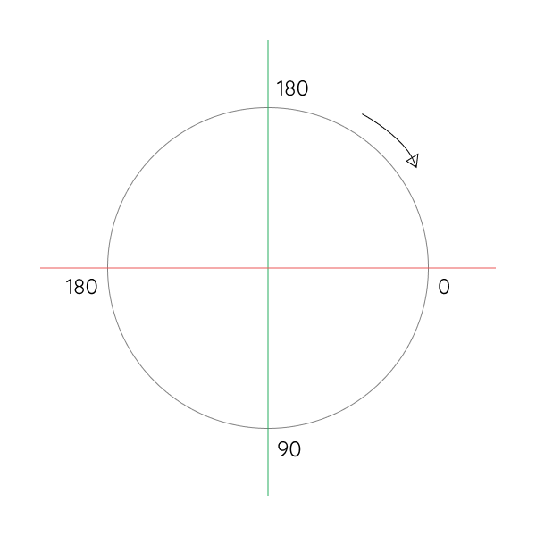
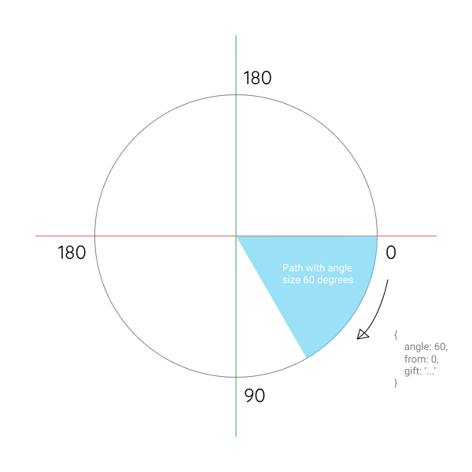

# Wheel Of Fortune

This project will help you to create Wheel Of Fortune with specific angle and custom design, you can focus on creating wheel design and set a gift defining **Angle Size** and **From Angle**.

### Note of Rotation



By default rotation origin of element on browser is like image above, so you can define a piece of wheel like example below.

### Piece example



If you create piece of wheel like image above, you can set the angle with **60** and from **0** because the piece location start on *0 degrees*.

### Documentation

```js
  const WOF = new WheelOfFortune({
    wheel: './wheel.svg',
    pieces: [
      { angle: 60, from: 300, gift: 'Gift 1' },
      { angle: 40, from: 0, gift: 'Gift 2' },
      { angle: 50, from: 40, gift: 'Gift 3' },
      { angle: 45, from: 90, gift: 'Gift 4' },
      { angle: 45, from: 135, gift: 'Gift 5' },
      { angle: 90, from: 180, gift: 'Gift 6' },
      { angle: 30, from: 270, gift: 'Gift 7' },
    ]
  });

  document.getElementById('run').addEventListener('click', function() {
    WOF.run();
  }, false);
```